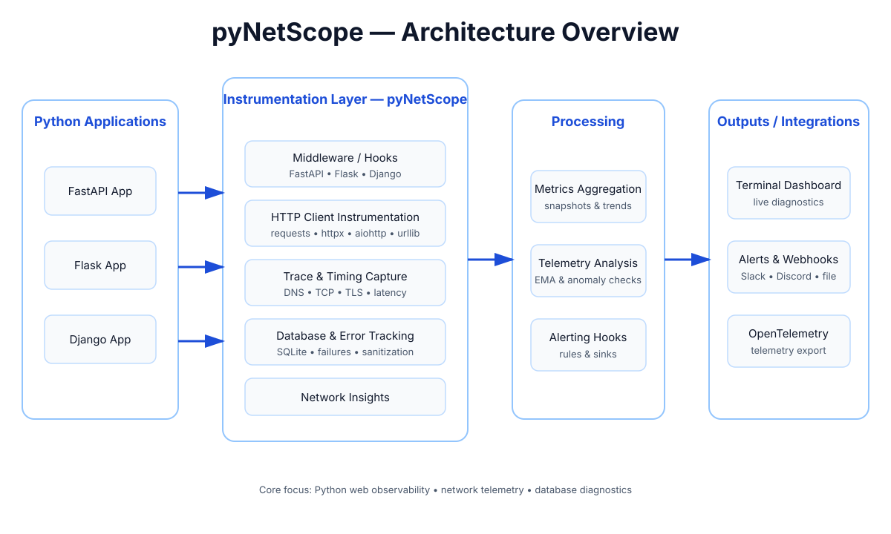

# pyNetScope

[](https://github.com/SahanPramuditha-Dev/pyNetScope/actions)
[](https://pypi.org/project/pynetscope/)
[](LICENSE)

Embedded network intelligence, observability, and client-side database diagnostics for Python applications.

`pyNetScope` provides lightweight, low-overhead monitoring for outgoing HTTP requests, database queries, endpoint health metrics, network speed, and path timings, complete with a terminal dashboard, anomaly detection, alerts, and OpenTelemetry compatibility.

---

## Architecture Overview



Applications integrate pyNetScope through middleware and client instrumentation. The library captures request, database, timing, and error telemetry, processes it into metrics and health signals, then exposes the results through terminal views, alerts, webhooks, and OpenTelemetry-compatible outputs.

---

## Key Features

- 🔌 **Client Interceptors**: Zero-overhead monkey-patching and adapters for `requests`, `httpx`, `aiohttp`, and `urllib`.
- 🗄️ **Database Diagnostics**: Instrumentation for `sqlite3` queries to log commands and track execution latency.
- 💻 **Interactive Live Terminal Dashboard**: Real-time health statistics with interactive row navigation (`Arrow Up/Down`, `w/s`, `j/k`) and request metadata inspection.
- 🧠 **Smart Anomaly Detection**: Tracks endpoint status using standard deviation baseline checks and rolling Exponential Moving Averages (EMA).
- 🛡️ **Dynamic PII & Payload Sanitization**: Configurable JSON/form payload scrubbing in `redact`, `mask`, and `hash` compliance modes.
- 🚨 **Multi-Channel Alert Sinks**: Alert rules engine supporting Slack, Discord, Console, File, and Webhook outputs.
- ⚡ **Path Timing & Speedtest**: Measures DNS/TCP/TLS timings and parallel speedtest diagnostics (including public DNS latencies).
- 🌉 **OpenTelemetry Bridge**: Retrospective OpenTelemetry span creation from observed records.
- ⚙️ **Middlewares**: Out-of-the-box middlewares for FastAPI, Flask, and Django.

---

## Installation

Install pyNetScope via pip:

```bash
pip install pynetscope
```

To enable full interactive terminal dashboards and OpenTelemetry exporters, install with optional dependencies:

```bash
pip install "pynetscope[rich,otel]"
```

---

## Quick Start

### 1. HTTP and SQLite Instrumentation

Simply instrument your libraries at startup to begin gathering telemetry:

```python
import sqlite3
import requests
from pynetscope import NetScope, instrument_sqlite

# Initialize core engine
scope = NetScope()

# Global instrumentation
scope.instrument_requests()
instrument_sqlite(scope)

# Perform some database operations
conn = sqlite3.connect(":memory:")
conn.execute("CREATE TABLE users (id INTEGER PRIMARY KEY, name TEXT)")
conn.execute("INSERT INTO users (name) VALUES ('Alice')")
conn.close()

# Perform an HTTP request
response = requests.get("https://api.github.com/zen")

# Inspect gathered metrics
snapshot = scope.snapshot()
print(snapshot["metrics"])
```

### 2. Django, Flask & FastAPI Middlewares

Easily track requests coming into your web applications.

**FastAPI**:
```python
from fastapi import FastAPI
from pynetscope import PyNetScopeMiddleware

app = FastAPI()
app.add_middleware(PyNetScopeMiddleware)
```

**Flask**:
```python
from flask import Flask
from pynetscope import PyNetScopeFlaskMiddleware

app = Flask(__name__)
PyNetScopeFlaskMiddleware(app)
```

**Django**:
Add the middleware to your `settings.py`:
```python
MIDDLEWARE = [
    "pynetscope.PyNetScopeDjangoMiddleware",
    # ...
]
```

---

## Advanced Configurations

### Dynamic PII Scrubbing
Configure sensitive headers, query keys, or payload parameters to be scrubbed. You can specify a compliance mode (`redact`, `mask`, or `hash`) and add custom regex patterns via `pynetscope.toml` or environment variables:

```toml
# pynetscope.toml
pii_mode = "mask" # "redact", "mask", or "hash"
pii_patterns = [
    "\\d{3}-\\d{3}-\\d{4}" # Custom regex to mask phone numbers
]
```

### Anomaly Detection & Alerts
Set up a `HealthEngine` with rolling EMA anomaly checks and route alerts to Slack and Discord webhooks:

```python
from pynetscope import NetScope, HealthEngine, AlertEngine, SlackAlertSink, DiscordAlertSink

# Define custom health settings with EMA
health = HealthEngine(use_ema=True, ema_alpha=0.15, ema_multiplier=2.5)

# Create webhook sinks
alerts = AlertEngine(sinks=[
    SlackAlertSink("https://hooks.slack.com/services/..."),
    DiscordAlertSink("https://discord.com/api/webhooks/...")
])
alerts.add_latency_rule(threshold_ms=500.0)

scope = NetScope(health=health, alerts=alerts)
```

---

## Command Line Interface (CLI)

`pyNetScope` provides a robust CLI to debug, benchmark, and monitor network health.

### Interactive live Watch Dashboard
Monitor any URL live in your terminal. Use `w/s`, `j/k`, or Arrow keys to navigate through endpoints and inspect full request metadata in the details panel:

```bash
pynetscope watch https://api.github.com/zen --interval 2.0
```

### Running Speedtest Diagnostics
Run throughput and latency benchmarks with public DNS resolver measurements:

```bash
pynetscope speedtest
```

### Path Timing Checks
Measure DNS, TCP, and TLS handshake timings:

```bash
pynetscope path https://api.github.com/
```

---

## License

This project is licensed under the MIT License. See the [LICENSE](LICENSE) file for details.
